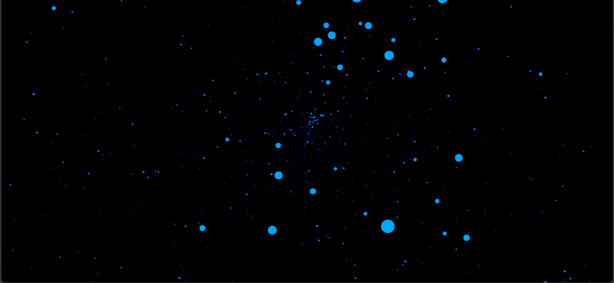

# 🌌 3D Particle Spiral Projection (Canvas Animation)

A mesmerizing **3D spiral animation** built using pure **JavaScript** and **HTML5 Canvas**, simulating particles rotating and moving in 3D space with interactive camera controls.

## 🎥 Preview

  

*If the GIF isn't playing, try opening this README in your browser.*

> 🖱️ **Drag with your mouse** or use your finger on touch devices to rotate the scene.  
> 🧪 Check the **"Random"** box in the corner to trigger dynamic distortion using trigonometric chaos.

## 🧠 Features

- 3D-like projection using 2D canvas math (no WebGL)
- Depth-based scaling and coloring
- Real-time interaction with mouse and touch
- Toggleable "chaos mode" using tangent curve distortions

## 🕹 Controls

| Action | Effect |
|--------|--------|
| Mouse drag / Touch move | Rotate view |
| Checkbox toggle | Enable/disable random projection warping |

## 📁 Files

- `index.html` – main HTML container
- `animation.js` – 3D point logic and animation loop
- `my.css` – styling for canvas and UI

